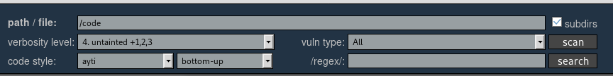

# rips-docker
Easy to use rips scanner docker-compose.

## Quick start

1. Get the code
```
git clone https://github.com/NeuronAddict/rips-docker.git
cd rips-docker
export CODE=/path/to/code/to/scan # your code to scan
docker-compose up
```

2. Go to localhost:8182 and type '/code' on the 'Path / file' form field : 



3. Click on 'scan'

4. Enjoy
